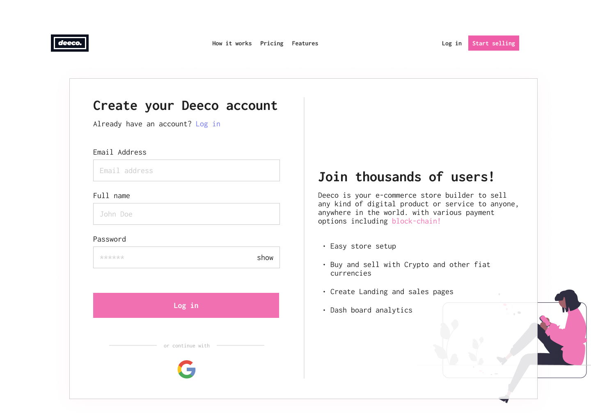
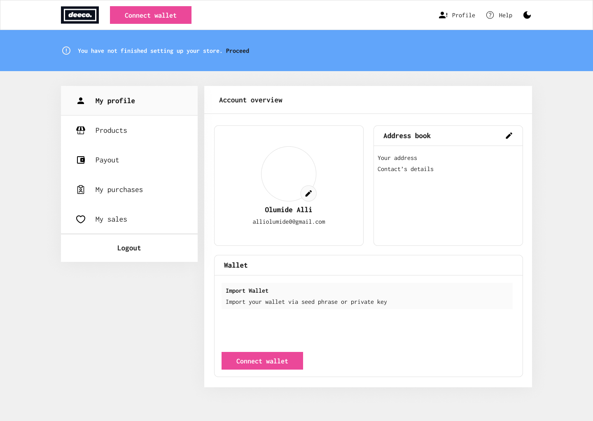
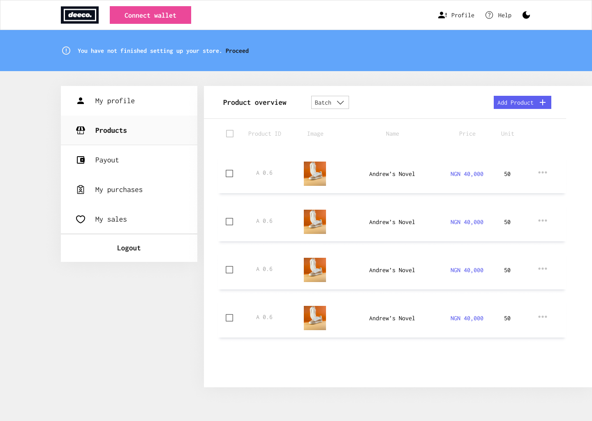

# deeco

Deeco is a project on a mission to democratize web3/crypto adoption by providing e-commerce platforms powered by various payments options - with the focus on crypto based payments.

Deeco is an amazing e-commerce solution that will take advantage of the many benefits of crypto and web3. It is an amazing app with payments to be powered directly by crypto tokens/coins.

The goal is a "mini Shopify + crypto-based payments" - and even more.

Deeco has a global scope - Thanks to the borderless power of cryptocurrency.

#### The project seeks to solve two(2) main problems.

1. The problem of limits - blockings and watchings: Limits set by financial institutions, can truly be advantageous, but these limits might sometimes be exploited to the disadvantage of the customers. Deeco is a project that removes all those blocking limits like credit card deposit and transfer limits. It provides the everyday e-commerce user with the power of so much freedom, transparency, and even security - if the smart contracts are well developed and audited.

2. The problem of public exclusion: Many folks out there, have probably only been hearing about cryptocurrency, blockchain and web3, but have never had a full experience or even a basic knowledge of the many awesome benefits of these innovations.Our intentional entrance into the web3 and the blockchain world, left us wowed at the many awesome super powers of web3 and blockchain technology. Being able to build a platform like deeco where public interaction can be easily enhanced, to bring more public inclusion from regular people on the streets, is truly a pleasure.

## Build stack/technologies

> This repository consist of both the client/front-end and server/backend aspects of the project.

We are a dynamic team comprised of two talented designers and four skilled developers. Our team of six individuals brings a diverse set of skills and perspectives, fostering a collaborative and innovative work environment. "deeco" was built with so much 💝 by us, below is a list of the main awesome technologies that we used.

1. NextJs/ReactJs
2. TailwindCSS
3. React context API
4. ExpressJs/NodeJs
5. JWT
6. Mongoose
7. Husky
8. Prettier
9. Eslint
10. Commitlint
11. Cookie-parser.
12. Ethers
13. React-quill
14. React-hot-toast

> The server/ backend was deployed on docker.

> MATIC token/coin was used as the default currency for shopping on deeco.

> Please note, that the deeco project is fully and superbly responsive. It fits extremely well on different screen sizes.

## Live site

> The project is hosted live. You can explore it via this link - https://deeco.vercel.app. Just take note to keep your metamask wallet handy.

## Screenshots

Below are some awesome screenshots from deeco.










## Setting up for development

Below, are some basic setups to help you set up a local development environment for deeco.

### Client/Front-end

1. Open the project root directory with your code editor.

or use the command below.

```

cd deeco


```

2. Run the following command to enter into the "client" folder.

```

cd client


```

3. Run the following command to enter into the "server" folder.

```

cd server


```

4. Run the below command in both the "client" and "server" folders to install all required dependencies.

```

npm install


```

5. When inside the "client" folder (after running the above install command), run the following command to start the app in development mode.

```

npm run dev


```

> Please take note that package management in this project is done using NPM Not PNPM or YARN.

> You might need to do some more setups if you're not using npm. If you ever get into any issues, just create a github issue, We'll respond as soon as possible. We're also a twitter DM or an email way.

- Twitter: https://twitter.com/AJ_Okpainmo

- Email: okpainmoandrew@gmail.com

- Phone: +234 81 8976 4364
